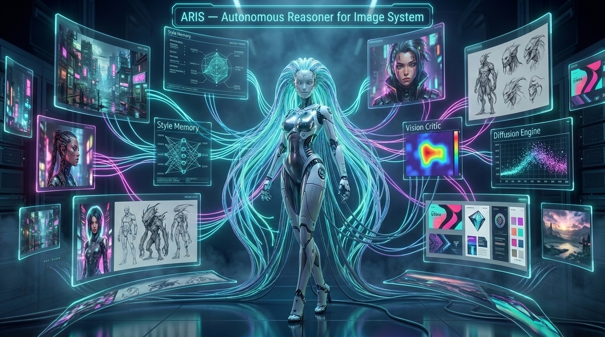

# ARIS — Autonomous Reasoner for Image System

<p align="center">
  
</p>

<p align="center">
  <a href="https://go.dev"></a>
  <a href="LICENSE"></a>
  <a href="https://github.com/SalvucciFacundo/ARIS/releases"></a>
  
  
  
</p>

<p align="center">
  <b>Autonomous AI Art Director, Visual Synthesizer & Image Reasoner built in pure Go.</b><br>
  <i>From natural language intent to model-tailored diffusion, VLM self-correction, masked inpainting, and multi-platform interfaces.</i>
</p>

---

## 🏷️ Topics & Keywords
`golang` • `ai-agent` • `image-generation` • `art-director` • `flux` • `comfyui` • `fal-ai` • `dall-e-3` • `inpainting` • `img2img` • `templ` • `htmx` • `templ-islands` • `tailwindcss` • `bubbletea` • `tui` • `telegram-bot` • `discord-bot` • `hexagonal-architecture` • `sqlite-fts5`

---

## 🚀 Quick Start

Get ARIS running in your terminal, as a desktop app, or self-hosted on a remote server instantly.

### Linux & macOS (One-Line Installer)
```bash
curl -fsSL https://raw.githubusercontent.com/SalvucciFacundo/ARIS/main/install.sh | bash
```

### Windows (PowerShell Installer)
```powershell
iwr -useb https://raw.githubusercontent.com/SalvucciFacundo/ARIS/main/install.ps1 | iex
```

### 🐧 Linux Native Packages (Debian, Ubuntu, Fedora, Arch, Alpine)
Download the native package for your distribution from [GitHub Releases](https://github.com/SalvucciFacundo/ARIS/releases):

- **Debian / Ubuntu / Mint / Pop!_OS (`.deb`):** `sudo dpkg -i aris_*_amd64.deb`
- **Fedora / RHEL / openSUSE (`.rpm`):** `sudo rpm -i aris-*.x86_64.rpm`
- **Arch Linux / CachyOS / Manjaro (`.pkg.tar.zst`):** `sudo pacman -U aris-*-x86_64.pkg.tar.zst`
- **Alpine Linux (`.apk`):** `apk add --allow-untrusted aris_*_x86_64.apk`
- **Universal Standalone Binary:** Download `aris-linux-amd64`, `chmod +x aris-linux-amd64`, move to `/usr/local/bin/aris`.

### 🐹 Install via Go (Go 1.23+)
```bash
go install github.com/SalvucciFacundo/ARIS/cmd/aris@latest
```

### 🛠️ Build from Source
```bash
git clone https://github.com/SalvucciFacundo/ARIS.git
cd ARIS
go build -o aris ./cmd/aris
```

---

## ✨ Key Features & Capabilities

### 🧠 10+ Specialized Visual Subagents
Talk directly to specialized art directors, prompt smiths, or photographers using the `@name` syntax in any interface:
`@director cinematic cyberpunk landscape` or `@photorealism 85mm portrait of an astronaut`.

| Subagent | Role | Specialty |
|---|---|---|
| **`@director`** | Art Director & Master Stylist | High-concept cinematography, lighting composition, spatial harmony. |
| **`@promptsmith`** | Prompt Optimization Engineer | Converts keywords into model-specific positive and negative syntax. |
| **`@photorealism`** | Optical & Camera Specialist | Focal length, aperture, bokeh, shutter speed, and skin texture realism. |
| **`@anime`** | Japanese Animation Director | Makoto Shinkai / Studio Ghibli aesthetics, cel-shading, vibrant palettes. |
| **`@concept-art`** | Production Concept Artist | Worldbuilding, matte painting, sci-fi/fantasy environment staging. |
| **`@cyberpunk`** | Neo-Tokyo & Sci-Fi Specialist | Volumetric neon lighting, holograms, chrome reflections, gritty tech. |
| **`@pixelart`** | Retro Pixel Specialist | Isometric pixel art, 16-bit palettes, clean dithering, sprite design. |
| **`@critic`** | Visual Quality Evaluator | Anatomical checks, lighting consistency, constraint verification. |
| **`@inpainter`** | Inpainting & Blending Artist | Seamless mask repairs, object removal, seamless edge blending. |
| **`@restyler`** | Style Transfer Specialist | Image-to-image restyling with calibrated denoise strength defaults. |

---

### 🎨 Autonomous Prompt Architect
Deconstructs vague or complex natural language requests into model-tailored technical parameters (lighting, composition, lenses, aspect ratios, CFG scales, seeds, and negative triggers).

### 💾 GAIA Knowledge Graph — Three-Scope Memory
Persistent 3-scope memory (User, Style, Project) in SQLite with FTS5 full-text search. Recalls your favorite styles, negative triggers, and character consistency across sessions. Includes an automatic auto-learning loop.

### 🔌 Multi-Backend Image Synthesis
Seamlessly switch between zero-config cloud APIs and local GPUs:
- **Pollinations.ai** (Default zero-config out-of-the-box, free & fast).
- **ComfyUI Local** (High-performance local GPU generation via WebSocket/REST).
- **Fal.ai** (Flux.1 Pro, Flux Dev, Inpainting).
- **OpenAI DALL-E 3 & Edits** (High prompt coherence and multipart inpainting).
- **Replicate & HuggingFace** (Community models & SD 3.5).

### 👁️ VLM Vision Critic & Self-Healing Loop
Optional vision language model critique (Ollama Qwen2.5-VL / GPT-4o Vision) that inspects generated images against user constraints and automatically refines and re-rolls if flaws are detected.

### 🖌️ Image-to-Image & Masked Inpainting (`aris edit`)
Transform existing images or perform localized inpainting with denoise strength control and mask validation.

### 🌐 Desktop GUI & Remote VPS Web Interface (`aris serve` / `aris gui`)
Zero-Node web application built with **`templ`**, **`templ-islands`**, **`HTMX`**, and **`TailwindCSS`** compiled into the single Go binary:
- **3-Panel Workspace**: Visual Gallery, Center Inpainting Canvas with drag & drop, and Conversational Chat.
- **Remote VPS Mode**: Self-host ARIS on a remote GPU box with Bearer Token auth and connect the desktop client seamlessly (`--remote https://vps.com --token secret`).
- **Real-Time SSE Streaming**: Live progress and reasoning events via `/api/events`.

### 🤖 Remote Messaging Gateways (`aris gateway`)
Run concurrent Telegram and Discord bots with centralized `JobQueue` worker pool concurrency control to prevent GPU VRAM exhaustion.

---

## 📖 Documentation Index

Explore the comprehensive technical guides in the [`docs/`](docs) directory:

| Guide | Description |
|---|---|
| 📖 **[CLI Commands Reference](docs/cli.md)** | Full command reference (`gen`, `edit`, `tui`, `gateway`, `serve`, `gui`, `memory`, `history`). |
| 🌐 **[Desktop GUI & Web Interface](docs/gui.md)** | 3-panel workspace, Templ Islands, HTMX, SSE streaming, and remote VPS client guide. |
| 🖌️ **[Img2Img & Inpainting Guide](docs/img2img.md)** | Image editing, mask drawing, denoise strength calibration, and subagent routing. |
| 🤖 **[Messaging Gateways (Bots)](docs/gateway.md)** | Telegram & Discord bot setup, token security, allowlists, and queue concurrency. |
| 🧠 **[Visual Subagents Deep-Dive](docs/subagents.md)** | Detailed subagent catalog, prompt recipes, and creating custom subagents in Go. |
| 🏛️ **[Hexagonal Architecture](docs/architecture.md)** | Ports & Adapters design, domain entities, and dependency inversion layout. |
| ⚙️ **[Configuration Reference](docs/configuration.md)** | Complete `config.yaml` reference and environment variable overrides. |
| 💾 **[Knowledge Graph Memory](docs/knowledge-graph.md)** | SQLite FTS5 3-scope memory model and automated style learning loop. |
| 👁️ **[Vision Critic & Self-Healing](docs/vlm-critic.md)** | VLM visual verification, prompt correction loops, and score thresholds. |
| 📑 **[Full Technical Specification](SPEC.md)** | The complete v1.0 architecture and system design specification. |

---

## 🏛️ Hexagonal Architecture (Ports & Adapters)

```text
┌─────────────────────────────────────────────────────────────────────────────┐
│                                  ARIS CORE                                  │
│                                                                             │
│   ┌─────────────────────────────────────────────────────────────────────┐   │
│   │                        ORCHESTRATOR / AGENT                         │   │
│   │  • ReAct Loop: Reason -> Plan -> Query Memory -> Synthesize -> Critic│  │
│   │  • Specialized Visual Subagents (@director, @promptsmith, etc.)     │   │
│   │  • Knowledge Graph Auto-Learning & Style Decomposer                 │   │
│   └──────────────────────────────────┬──────────────────────────────────┘   │
│                                      │                                      │
│   ┌──────────────────────────────────▼──────────────────────────────────┐   │
│   │                                PORTS                                │   │
│   │  ┌──────────────────┐  ┌──────────────────┐  ┌──────────────────┐   │   │
│   │  │   LLMProvider    │  │   ImageBackend   │  │   VisionCritic   │   │   │
│   │  └──────────────────┘  └──────────────────┘  └──────────────────┘   │   │
│   │  ┌──────────────────┐  ┌──────────────────┐  ┌──────────────────┐   │   │
│   │  │  KnowledgeGraph  │  │   HistoryStore   │  │  GatewayAdapter  │   │   │
│   │  └──────────────────┘  └──────────────────┘  └──────────────────┘   │   │
│   └──────────────────────────────────┬──────────────────────────────────┘   │
└──────────────────────────────────────┼──────────────────────────────────────┘
                                       │
┌──────────────────────────────────────▼──────────────────────────────────────┐
│                                  ADAPTERS                                   │
│                                                                             │
│  [LLM]           OpenAI, Anthropic, Ollama, DeepSeek, OpenRouter, Groq      │
│  [Image Backend] Pollinations (Default/Free), ComfyUI (Local), Fal.ai,      │
│                  Replicate, OpenAI DALL-E 3, HuggingFace                    │
│  [Vision Critic] Ollama (Qwen2.5-VL), OpenAI / Claude Vision                │
│  [Storage / KG]  SQLite3 + FTS5 Full-Text Search (GAIA 3-Scope Model)       │
│  [Gateways]      Telegram Bot & Discord Bot with JobQueue concurrency       │
│  [Presentation]  • Interactive Cyberpunk TUI (Bubbletea + Lipgloss)         │
│                  • Desktop GUI & Remote VPS Web (Templ + Islands + HTMX)    │
│                  • Headless CLI (`aris gen`, `aris edit`, `aris serve`)     │
└─────────────────────────────────────────────────────────────────────────────┘
```

---

## 📊 Project Stats

| Metric | Value |
|---|---|
| **Language** | Go 1.23+ |
| **Architecture** | Hexagonal (Ports & Adapters) |
| **Image Backends** | 6+ Supported (Pollinations, ComfyUI, Fal.ai, OpenAI DALL-E 3, Replicate, HuggingFace) |
| **Visual Subagents** | 10+ Built-in (`@director`, `@promptsmith`, `@inpainter`, `@restyler`, `@photorealism`, etc.) |
| **User Interfaces** | Cyberpunk TUI (Bubbletea), Desktop Window, Web UI Dashboard (`templ-islands`), CLI |
| **Gateway Bots** | Telegram Bot, Discord Bot (with worker pool concurrency) |
| **Testing** | Strict TDD (100% PASS, Race-Detector Clean) |
| **Binary Size** | Single standalone binary (~18 MB), Zero Node.js runtime dependencies |
| **License** | MIT |

---

## 🤝 Contributing & Community

We welcome contributions from the community! Whether you want to add a new image backend, create a visual subagent, improve the TUI/GUI, or report a bug:

1. **Check Issues**: Search open [Issues](https://github.com/SalvucciFacundo/ARIS/issues) before opening a new one.
2. **Open an Issue**:
   - 🐛 **Bug Reports**: Include OS/Arch, Go version, backend used, reproduction steps, and error logs.
   - 💡 **Feature Requests**: Describe the proposed capability and architectural fit.
3. **Fork & Branch**: Create a feature branch (`git checkout -b feat/my-new-feature`).
4. **Follow Strict TDD & Code Standards**:
   - Write unit tests first (RED $\to$ GREEN).
   - Verify zero data races: `go test -count=1 -race ./...`
   - Ensure clean formatting: `go vet ./...`
5. **Commit with Conventional Commits**: `feat: ...`, `fix: ...`, `docs: ...`, `refactor: ...`, `test: ...`.
6. **Submit a Pull Request**: Ensure CI checks pass.

---

## 🙏 Acknowledgments & Ecosystem

ARIS is inspired by and interoperates with leading open-source architectures:
- **[GAIA](https://github.com/SalvucciFacundo/gaia)** — Autonomous reasoner lifecycle and 3-scope Knowledge Graph model.
- **[Gentle AI](https://github.com/Gentleman-Programming/gentle-ai)** — Spec-Driven Development (SDD) discipline and harness engineering.
- **[templ-islands](https://github.com/SalvucciFacundo/templ-islands)** — Optimistic Go-native UI components without JavaScript framework overhead.

---

## 📄 License

Distributed under the **MIT License**. See [`LICENSE`](LICENSE) for details.
